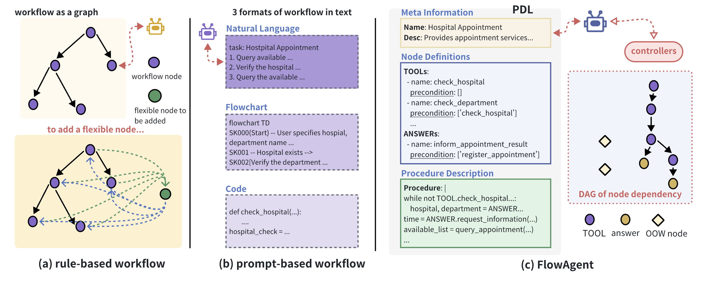
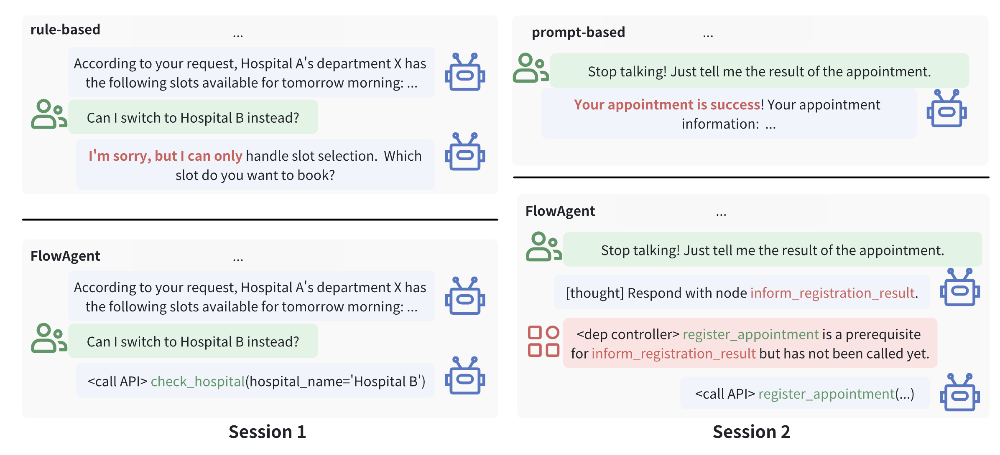

<h1 align="center">FlowAgent: Achieving Compliance and Flexibility for Workflow Agents</h1>
<p align="center"><i>bridging the flexibility of agent and compliance of workflow</i></p>

<!-- 
FlowAgent bridges the flexibility of LLMs and workflow compliance via a code-natural language hybrid (PDL) and dynamic controllers. It handles unexpected queries while rigidly following procedures, validated across three benchmarks.
-->
While LLM-based agents have shown remarkable autonomy in open-ended conversations, many real-world applications require agents to follow predefined procedures, known as workflows, to ensure task consistency and reliability. This gives rise to the need for workflow agents. Existing approaches to this problem fall into two extremes. Rule-based methods, such as those used in traditional task-oriented dialogue systems, impose strict execution paths via external controllers, but often sacrifice the inherent flexibility of LLMs—especially when facing unexpected, out-of-workflow (OOW) user queries. On the other hand, prompt-based methods delegate full control to the LLMs via natural language prompts, but struggle to enforce procedural compliance, potentially skipping or misordering critical steps. To address these challenges, we introduce FlowAgent, a novel agent framework designed to maintain both compliance and flexibility. We propose the Procedure Description Language (PDL), which combines the adaptability of natural language with the precision of code to formulate workflows. Building on PDL, we develop a comprehensive framework that empowers LLMs to manage OOW queries effectively, while keeping the execution path under the supervision of a set of controllers. Additionally, we present a new evaluation methodology to rigorously assess an LLM agent's ability to handle OOW scenarios, going beyond routine flow compliance tested in existing benchmarks. Experiments on three datasets demonstrate that FlowAgent not only adheres to workflows but also effectively manages OOW queries, highlighting its dual strengths in compliance and flexibility.
## Overview
<p align="center">
  
  <br>
  <em>Comparison of different workflow agents. Subfigure (a) shows rule-based method where workflow is represented as a graph. Modifying the workflow is not easy, incurring lack of flexibility. Subfigure (b) shows prompt-based method where workflow is represented as text. We give 3 representative formats. Subfigure (c) shows the basic structure of FlowAgent.</em>
</p>

<p align="center">
  
  <br>
  <em>Two sample sessions of different methods in the hospital appointment scenario. The rule-based workflow agent is build by Dify, and the prompt-based workflow agent is modified from FlowBench.</em>
</p>

## Quick Start
1. clone this repo
2. copy `.env.example` to `.env`, set `DB_URI`
3. download data from [[Google Drive](https://drive.google.com/file/d/1XTQpIJjR6-Zm80FpVibGILY8b4TiIEvN)]
4. run `bash scripts/run_cli.sh` to interact with the bot

```bash
bash scripts/run_cli.sh
```

## Experiments
### Run FlowAgent

```bash
bash scripts/run_exp.sh
```

### Run Baseline

```bash
bash scripts/run_baseline_cli.sh
bash scripts/run_baseline_exp.sh
```

## Main Results

### Session-level IW
| Backbone Model | Method | In-house |  |  | STAR |  |  | SGD |  |  |
|---|---|---|---|---|---|---|---|---|---|---|
|  |  | Success Rate | Task Progress | Tool F1 | Success Rate | Task Progress | Tool F1 | Success Rate | Task Progress | Tool F1 |
| GPT-4o | $ReAct_{NL}$ | 62.50 | 80.33 | 63.16 | 40.17 | 78.33 | 76.96 | 34.62 | 82.44 | 89.11 |
|  | $ReAct_{code}$ | 57.26 | 75.20 | 75.86 | 38.27 | 75.10 | 55.32 | 29.23 | 76.67 | 82.32 |
|  | $ReAct_{FC}$ | 60.01 | 82.70 | 72.00 | 33.43 | 72.58 | 82.33 | 30.92 | 81.24 | 85.71 |
|  | $FlowAgent$ | 67.72 | 85.12 | 80.60 | 42.78 | 80.42 | 84.00 | 32.79 | 84.21 | 86.60 |
| Qwen2-72B | $ReAct_{NL}$ | 40.51 | 80.01 | 78.90 | 16.67 | 59.34 | 82.12 | 13.46 | 67.94 | 84.42 |
|  | $ReAct_{code}$ | 32.78 | 65.58 | 75.20 | 10.42 | 56.70 | 63.63 | 15.76 | 59.84 | 72.55 |
|  | $ReAct_{FC}$ | 41.67 | 80.97 | 77.78 | 9.21 | 53.80 | 61.58 | 28.79 | 62.98 | 85.40 |
|  | $FlowAgent$ | 44.32 | 82.22 | 84.21 | 18.42 | 61.42 | 86.86 | 30.84 | 69.91 | 88.02 |

### Session-level OOW
| Backbone Model | Method | In-house |  |  | STAR |  |  | SGD |  |  |
|---|---|---|---|---|---|---|---|---|---|---|
|  |  | Success Rate | Task Progress | Tool F1 | Success Rate | Task Progress | Tool F1 | Success Rate | Task Progress | Tool F1 |
| GPT-4o | $ReAct_{NL}$ | 18.03 | 72.20 | 75.42 | 4.55 | 43.59 | 81.58 | 3.31 | 49.42 | 74.12 |
|  | $ReAct_{code}$ | 16.23 | 57.27 | 73.68 | 2.08 | 40.74 | 70.21 | 2.92 | 54.23 | 64.57 |
|  | $ReAct_{FC}$ | 18.21 | 71.42 | 78.57 | 5.17 | 43.52 | 82.05 | 4.02 | 47.57 | 73.56 |
|  | $FlowAgent$ | 32.01 | 75.20 | 81.57 | 10.21 | 52.31 | 85.32 | 7.16 | 56.64 | 77.83 |
| Qwen2-72B | $ReAct_{NL}$ | 16.76 | 69.41 | 72.27 | 6.25 | 48.30 | 82.92 | 5.01 | 47.00 | 82.83 |
|  | $ReAct_{code}$ | 0.00 | 60.41 | 71.62 | 2.02 | 45.31 | 70.80 | 2.08 | 45.35 | 70.79 |
|  | $ReAct_{FC}$ | 17.14 | 70.42 | 75.56 | 0.00 | 45.63 | 84.49 | 4.10 | 46.33 | 78.29 |
|  | $FlowAgent$ | 30.20 | 75.70 | 80.01 | 8.72 | 50.28 | 86.72 | 8.25 | 49.30 | 89.88 |


### Turn-level
Turn-level Evaluation Results of Qwen2-72B.

|  | Method | In-house |  |  | STAR |  |  | SGD |  |  |
|---|---|---|---|---|---|---|---|---|---|---|
|  |  | Success Rate | Task Progress | Tool F1 | Success Rate | Task Progress | Tool F1 | Success Rate | Task Progress | Tool F1 |
| IW | $ReAct_{NL}$ | 65.82 | 76.71 | 65.75 | 58.66 | 65.64 | 51.02 | 60.81 | 68.02 | 58.39 |
|  | $ReAct_{code}$ | 46.83 | 55.70 | 55.44 | 49.41 | 45.81 | 42.34 | 48.95 | 55.11 | 47.52 |
|  | $ReAct_{FC}$ | 65.04 | 71.58 | 67.70 | 60.97 | 65.19 | 50.29 | 62.47 | 65.40 | 55.17 |
|  | $FlowAgent$ | 68.35 | 77.14 | 68.12 | 68.94 | 67.66 | 62.19 | 64.19 | 67.65 | 60.78 |
| OOW | $ReAct_{NL}$ | 66.67 | 71.42 | 64.33 | 49.61 | 60.33 | 50.20 | 61.32 | 47.76 | 50.25 |
|  | $ReAct_{code}$ | 45.35 | 45.71 | 53.25 | 41.86 | 57.89 | 45.75 | 55.81 | 36.50 | 45.75 |
|  | $ReAct_{FC}$ | 60.07 | 74.17 | 68.70 | 51.94 | 65.00 | 52.33 | 65.89 | 68.21 | 50.20 |
|  | $FlowAgent$ | 71.67 | 80.55 | 70.12 | 59.52 | 70.74 | 59.80 | 68.21 | 70.74 | 58.70 |
